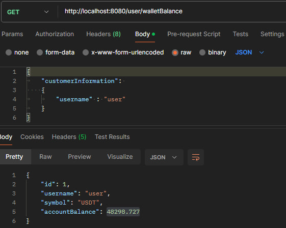
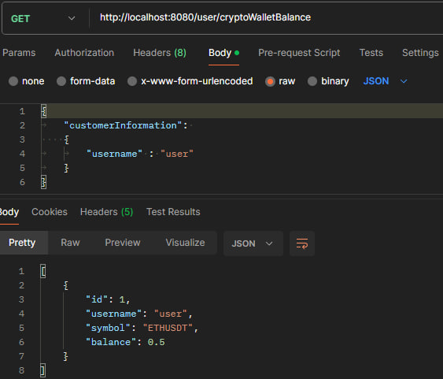
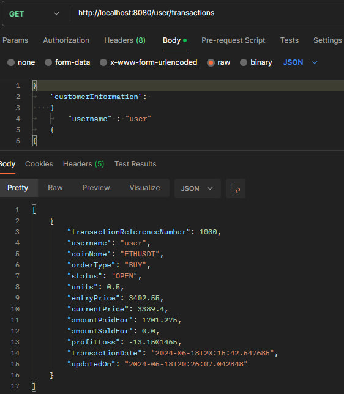
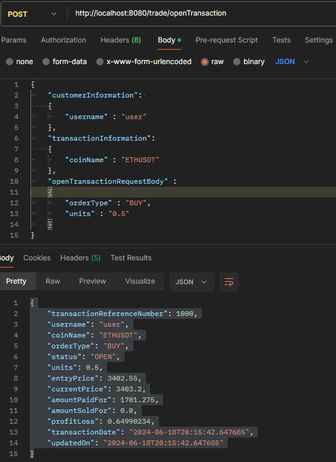
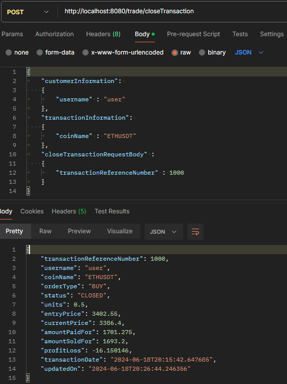

# FinTechCryptoTradingApplication
## A Crypto Trading System using Java Spring Boot and H2 Database.

## [Binance API](https://api.binance.com/api/v3/ticker/bookTicker)
[Binance API Documentation](https://developers.binance.com/docs/binance-spot-api-docs/rest-api#symbol-order-book-ticker)

## [Huobi API](https://api.huobi.pro/market/tickers)
[Huobi API Documentation](https://huobiapi.github.io/docs/spot/v1/en/#get-latest-tickers-for-all-pairs)

## H2 Database
### Access
|H2 Console URL |http://localhost:8080/h2-console/|
|---------------|---------------------------------|
|Driver Class |org.h2.Driver|
|JDBC URL |jdbc:h2:mem:testdb|
|User Name |user|
|Password |password|

### Tables

|Tables|Remarks|
|------|-------|
|COIN_PRICE|Stores the **ASK_PRICE** and **BID_PRICE**, which will be updated every 10 seconds by the App.|
|TRANSACTIONS|Stores all Transactions made by the users **CURRENT_PRICE** will be updated every 10 seconds by the App for all transactions with **OPENED** STATUS. |
|USER|Stores available users. |
|USER_CRYPTO_WALLET|Stores the Crypto Currencies purchased/sold by the user, where balance are the number of units purchased/sold. Balance will be deducted when a user decides to CLOSE the transaction. Should the Balance reach 0, the row will be deleted. |
|USER_WALLET|Stores the account balance for amount of USDT. |

## Endpoints
| End Points                                     |Remarks| Sample Request/Response                                                                                                                                                                                                                                                                                                                                                                                                                                                                                                                                                                                                                                                                                                                                                                                                                                            |
|------------------------------------------------|-|--------------------------------------------------------------------------------------------------------------------------------------------------------------------------------------------------------------------------------------------------------------------------------------------------------------------------------------------------------------------------------------------------------------------------------------------------------------------------------------------------------------------------------------------------------------------------------------------------------------------------------------------------------------------------------------------------------------------------------------------------------------------------------------------------------------------------------------------------------------------|
| http://localhost:8080/coin/getCoinPrice        |To get the latest aggregated coin prices, which are stored in the **COIN_PRICE** database table| <pre>&#13;Request :  http://localhost:8080/coin/getCoinPrice  Response :  [&#13;  {&#13;    "id": 1,&#13;    "symbol": "BTCUSDT",&#13;    "bidPrice": 67647.82,&#13;    "askPrice": 67648.01,&#13;    "updatedOn": "2024-06-13T12:30:34.198279"&#13;},&#13;{&#13;    "id": 2,&#13;    "symbol": "ETHUSDT",&#13;    "bidPrice": 3515.64,&#13;    "askPrice": 3515.78,&#13;    "updatedOn": "2024-06-13T12:30:34.202309"&#13;    }&#13;]</pre>Screenshot :                                                                                                                                                                                                                                                                   |
| http://localhost:8080/user/walletBalance       |To view the USDT Wallet Balance, used for buying/selling, from **USER_WALLET** table| JSON Request: <pre lang="json">{&#13;  "customerInformation": &#13;  {&#13;  	"username" : "user"&#13;  }&#13;}</pre> JSON Response: <pre lang="json">{&#13;  "id": 1,&#13;  "username": "user",&#13;  "symbol": "USDT",&#13;  "accountBalance": 48298.727&#13;}</pre>Screenshot :                                                                                                                                                                                                                                                                                                                                                                                                                                                                                                                         |
| http://localhost:8080/user/cryptoWalletBalance |To view the Crypto Currencies Wallet Balance, from **USER_CRYPTO_WALLET** table| JSON Request: <pre lang="json">{&#13;  "customerInformation": &#13;  {&#13;  	"username" : "user"&#13;  }&#13;}</pre> JSON Response: <pre lang="json">{&#13;  "id": 1,&#13;  "username": "user",&#13;  "symbol": "USDT",&#13;  "balance": 0.5&#13;}</pre>Screenshot :                                                                                                                                                                                                                                                                                                                                                                                                                                                                                                                                |
| http://localhost:8080/user/transactions        |To view all Transactions, made by the User, from **TRANSACTIONS** table| JSON Request: <pre lang="json">{&#13;  "customerInformation": &#13;  {&#13;  	"username" : "user"&#13;  }&#13;}</pre> JSON Response: <pre lang="json">[&#13;  {&#13;    "transactionReferenceNumber": 1000,&#13;    "username": "user",&#13;    "coinName": "ETHUSDT",&#13;    "status": "OPEN",&#13;    "units": 0.5,&#13;    "entryPrice": 3402.55,&#13;    "currentPrice": 3400.79,&#13;    "amountPaidFor": 1701.275,&#13;    "amountSoldFor": 0.0,&#13;    "profitLoss": -1.7600098,&#13;    "transactionDate": "2024-06-18T20:15:42.647685",&#13;    "updatedOn": "2024-06-18T20:19:32.707391"&#13;  }&#13;]</pre>Screenshot :                                                                                                                                                                              |
| http://localhost:8080/trade/openTransaction    |To buy/sell the supported Crypto Currencies, and update **TRANSACTIONS** table. (Currently supported Crypto Currencies : Ethereum - ETHUSDT and Bitcoin - BTCUSDT)| JSON Request: <pre lang="json">{&#13;  "customerInformation": &#13;  {&#13;  	"username" : "user"&#13;  },&#13;  "transactionInformation": &#13;  {&#13;  	"coinName" : "ETHUSDT"&#13;  },&#13;  "openTransactionRequestBody" :&#13;  {&#13;  	"orderType" : "BUY",&#13;  	"units" : "0.5"&#13;  }&#13;}</pre> JSON Response: <pre lang="json">{&#13;  "transactionReferenceNumber": 1000,&#13;  "username": "user",&#13;  "coinName": "ETHUSDT",&#13;  "orderType": "BUY",&#13;  "units": 0.5,&#13;  "entryPrice": 3402.55,&#13;  "amountPaidFor": 1701.275,&#13;  "amountSoldFor": 0.0,&#13;  "profitLoss": 0.64990234,&#13;  "transactionDate": "2024-06-18T20:15:42.647685",&#13;  "updatedOn": "2024-06-18T20:15:42.647685"&#13;}</pre>Screenshot :                                                   |
| http://localhost:8080/trade/closeTransaction   |To close the transaction, in **TRANSACTION** table, and route the profit to USER_WALLET table| JSON Request: <pre lang="json">{&#13;  "customerInformation": &#13;  {&#13;  	"username" : "user"&#13;  },&#13;  "transactionInformation": &#13;  {&#13;  	"coinName" : "ETHUSDT"&#13;  },&#13;  "closeTransactionRequestBody" :&#13;  {&#13;  	"transactionReferenceNumber" : 1000&#13;  }&#13;}</pre> JSON Response: <pre lang="json">{&#13;  "transactionReferenceNumber": 1000,&#13;  "username": "user",&#13;  "coinName": "ETHUSDT",&#13;  "orderType": "BUY",&#13;  "status": "CLOSED",&#13;  "units": 0.5,&#13;  "entryPrice": 3402.55,&#13;  "currentPrice": 3386.4,&#13;  "amountPaidFor": 1701.275,&#13;  "amountSoldFor": 1693.2,&#13;  "profitLoss": -16.150146,&#13;  "transactionDate": "2024-06-18T20:15:42.647685",&#13;  "updatedOn": "2024-06-18T20:26:44.246356"&#13;}</pre>Screenshot :  |

## Technology Used :
* Java
* H2 Database
* [Binance API](https://api.binance.com/api/v3/ticker/bookTicker)
* [Huobi API](https://api.huobi.pro/market/tickers)

## Note :
Currently supported symbols : **ETHUSDT, BTCUSDT**.
 Add to [CommonConstants.java](https://github.com/mryswah/FinTechCryptoTradingApplication/blob/master/src/main/java/com/fintech/cryptotrading/constant/CommonConstant.java#L21-L25) to enable price aggregation for new additional symbols.  **(Assuming that the symbols are supported by both Binance and Huobi APIs)**
  

Two users, user and user1, are created by default.
 user has 50000 USDT initial value.
 Modify the following [data.sql](https://github.com/mryswah/FinTechCryptoTradingApplication/blob/master/src/main/resources/data.sql#L1-L8) to update the initial database records on server startup.
  
 

